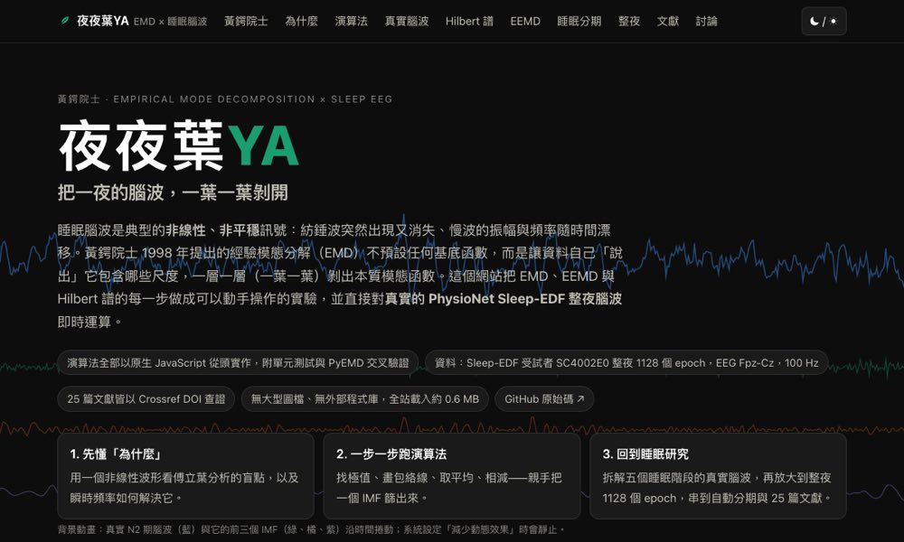

# 夜夜葉YA — EMD × 睡眠腦波互動導覽

> 把一夜的腦波，一葉一葉剝開。
> AI Agent × Biomedical Signal Analysis 課程作業（黃鍔院士演講前導）。主題：**經驗模態分解（EMD）在睡眠研究中的意義**。



| | 連結 |
| --- | --- |
| 🌐 網站（GitHub Pages） | https://kateep010.github.io/emd-sleep-explorer/ |
| 💻 原始碼 | https://github.com/Kateep010/emd-sleep-explorer |

## 這個網站做什麼

一個純靜態、零依賴的互動教學網站，把 EMD 的每一步做成可以動手操作的實驗，並直接對**真實的 PhysioNet Sleep-EDF 睡眠腦波**在瀏覽器裡即時運算：

| 章節 | 內容 | 互動 |
| --- | --- | --- |
| 00 黃鍔院士 | 生平（Wikipedia 查證）與 10 篇本人關鍵論文的時間線，每篇標註對本站哪一節的意義 | 跳轉到對應實驗 |
| 01 為什麼 | 傅立葉分析對非線性、非平穩訊號的盲點；瞬時頻率 | 調整非線性程度 ε，比較傅立葉頻譜與 Hilbert 瞬時頻率 |
| 02 演算法 | 篩選（sifting）：極值 → 三次樣條包絡線 → 平均 → 相減 → SD 停止準則 | 一步一步（或自動播放）把 IMF 篩出來，可切換合成／真實訊號與 SD 門檻 |
| 03 真實腦波 | 五個睡眠階段（W/N1/N2/N3/REM）的 30 秒真實 EEG 拆成 IMF，標上平均瞬時頻率與頻帶 | 選階段、片段、EMD／EEMD、集成次數與雜訊振幅 |
| 04 Hilbert 譜 | Hilbert 譜 vs. STFT 頻譜圖、邊際譜 vs. 傅立葉譜 | 動態範圍切換，滑鼠讀值 |
| 05 EEMD | 模態混疊的成因與 EEMD 的解法 | 合成「慢波 + 間歇紡錘波」，調整振幅、雜訊、集成次數 |
| 06 睡眠分期 | Hassan & Bhuiyan 流程的簡化重現：IMF 特徵 → 散佈圖 → 留一法最近質心 | 任選兩個 IMF 特徵作 X/Y 軸 |
| 07 整夜 | 整夜 1128 個 epoch 的 IMF 特徵沿時間與專家 hypnogram 對照；各階段中位數；整夜留一法分類與混淆矩陣，特徵來源 EMD／EEMD、特徵集 2／10／26 個、最近質心／k-NN，附結果階梯表 | 特徵與平滑選擇、任選分類設定 |
| 08 文獻 | 25 篇以 Crossref DOI 查證的文獻，分方法／分期／呼吸中止／紡錘波／資料來源五條線 | 標籤篩選 |
| 09 討論 | 與 AI 討論的紀錄、設計決策、驗證方式、已知限制 | — |

## 整夜分類結果階梯（單一受試者留一法，`tools/eval_night.mjs`）

| 設定 | 特徵數 | 準確率 | κ |
| --- | ---: | ---: | ---: |
| EMD · δ 能量 × RMS · 最近質心 | 2 | 68.3 % | 0.58 |
| EMD · 10 個摘要特徵 · k-NN (k=7) | 10 | 82.7 % | 0.77 |
| EEMD · 10 個摘要特徵 · k-NN | 10 | 84.5 % | 0.79 |
| EEMD · 摘要 + 8 個模態的頻率與能量 · k-NN | 26 | 84.2 % | 0.79 |
| 參考：YASA（Week 1 作業，同一受試者） | — | 84.2 % | 0.79 |

相鄰 epoch 高度相關，單一受試者內的留一法會比跨受試者驗證樂觀；這張表說明的是「IMF 特徵蘊含多少睡眠結構資訊」，不是可推廣的分期效能。

## 技術重點

- **演算法全部以原生 JavaScript 從頭實作**（`js/emd.js`，無任何第三方套件）：
  局部極值、自然三次樣條（Thomas 演算法）、Rilling 鏡像邊界延伸、篩選（SD 與 S-number 停止準則）、EMD、EEMD（可中斷的非同步版本）、
  任意長度 FFT（Bluestein）、Hilbert 轉換／瞬時頻率、Hilbert 譜、STFT 頻譜圖、功率譜。
- **單元測試**：`node tests/test_emd.mjs`（樣條、FFT 對照直接 DFT、Hilbert 對純音的瞬時頻率、EMD 完備重建、雙音分離、模態混疊 EMD vs EEMD、16 個真實 epoch 的重建）。
- **與 PyEMD 交叉驗證**：[`docs/validation.md`](docs/validation.md)。停止準則對齊後前三階 IMF 相關係數中位數 0.83，高／低頻合計 0.87／0.89；差異來源為停止準則與樣條種類，並示範了「過度篩選」的效應。
- **整夜資料**：`data/night.js` 為 1128 個 epoch 的 EMD 特徵（`tools/dump_night.py` 匯出整夜 EEG → `tools/night_features.mjs` 以 `js/emd.js` 逐 epoch 計算，約 10 秒）；`data/night_eemd.js` 為 EEMD（50 次集成、8 個模態）特徵（`tools/night_features_eemd.mjs`，約 90 秒），只在切換時才載入。
- **頁面重量**：無圖檔、無外部程式庫；首次載入約 0.6 MB（含 16 個真實 epoch 與整夜 EMD 特徵），EEMD 特徵另 0.25 MB 按需載入。README 預覽圖 `preview.jpg` 壓縮至 100 KB 以下。
- **圖表**：`js/charts.js` 自製 canvas 折線圖／熱圖／散佈圖，含十字游標與 tooltip、鍵盤操作、HiDPI、深淺色主題。
- **資料**：`data/epochs.json`（同內容的 `data/epochs.js` 供 `file://` 直接開啟）— Sleep-EDF Expanded 受試者 SC4002E0，EEG Fpz-Cz，100 Hz，
  每階段 3–4 個 30 秒 epoch，由 `tools/extract_epochs.py`（MNE + YASA）產生：避開階段邊界、排除 >150 µV 雜訊、N2 優先挑選含紡錘波片段、清醒期排除 >80 µV 眼動漂移。

## 本地執行

```bash
git clone https://github.com/Kateep010/emd-sleep-explorer.git
cd emd-sleep-explorer
python3 -m http.server 8000      # 或直接雙擊 index.html 也可以
# 測試
node tests/test_emd.mjs
```

## 部署

本站為純靜態網站（無建置步驟），三種平台皆與 GitHub repo 連動：

| 平台 | 方式 | 狀態 |
| --- | --- | --- |
| **GitHub Pages** | Settings → Pages → Deploy from branch `main` / root | ✅ 已上線，每次 push 自動更新 |
| **Zeabur** | Zeabur 專案 → Deploy from Git → 選此 repo → 類型 Static（`zeabur.json` 已設定輸出目錄為根目錄，與同學 klab-emd.zeabur.app 相同做法） | ⚠️ 需可建立專案的 Zeabur 帳號；2026 年 9 月官方文件標示共享叢集已停止服務，新帳號需先綁定伺服器（見下） |
| **Cloudflare Workers** | `npx wrangler login && npx wrangler deploy`（設定檔 `wrangler.jsonc`，static assets 模式） | 設定檔已備妥 |

### 關於 Zeabur

作業原規劃部署至 Zeabur。查閱 Zeabur 官方文件（[專用伺服器](https://zeabur.com/docs/zh-TW/dedicated-server)、[Free Plan](https://zeabur.com/docs/en-US/pricing/free-plan)）後確認：
「共享叢集（已停止服務）」，建立專案前必須先綁定或購買伺服器（按月固定計費）。
因此以 GitHub Pages 作為主要公開網址；repo 已是 Zeabur 可直接辨識的靜態專案，若日後綁定伺服器，
在 Zeabur 控制台選擇此 repo 即可部署，無需修改任何檔案。

## 文獻（皆經 Crossref 查證）

網站第 08 節共 25 篇；以下列出核心 16 篇，其餘 9 篇（Huang 2003 信賴區間、Flandrin 2004 濾波器組、Liang 2005 神經資料、Yeh 2010 CEEMD、Colominas 2014 ICEEMDAN、Huang 2016 HHSA、Hassan 2016 Biocybern.、Kemp 2000 與 Goldberger 2000 資料來源）見網站。

1. Huang NE, et al. (1998). The empirical mode decomposition and the Hilbert spectrum for nonlinear and non-stationary time series analysis. *Proc. R. Soc. Lond. A* 454:903–995. doi:10.1098/rspa.1998.0193
2. Huang NE, Wu Z, Long SR, Arnold KC, Chen X, Blank K (2009). On instantaneous frequency. *Adv. Adapt. Data Anal.* 1(2):177–229. doi:10.1142/S1793536909000096
3. Wu Z, Huang NE (2009). Ensemble empirical mode decomposition: a noise-assisted data analysis method. *Adv. Adapt. Data Anal.* 1(1):1–41. doi:10.1142/S1793536909000047
4. Rehman N, Mandic DP (2010). Multivariate empirical mode decomposition. *Proc. R. Soc. A* 466:1291–1302. doi:10.1098/rspa.2009.0502
5. Torres ME, Colominas MA, Schlotthauer G, Flandrin P (2011). A complete ensemble empirical mode decomposition with adaptive noise. *IEEE ICASSP*, 4144–4147. doi:10.1109/ICASSP.2011.5947265
6. Lo MT, Tsai PH, Lin PF, Lin C, Hsin YL (2009). The nonlinear and nonstationary properties in EEG signals: probing the complex fluctuations by Hilbert–Huang transform. *Adv. Adapt. Data Anal.* 1(3):461–482. doi:10.1142/S1793536909000199
7. Li Y, Fan Y, Gu L, Tong Q (2009). Sleep stage classification based on EEG Hilbert-Huang transform. *IEEE ICIEA*, 3676–3681. doi:10.1109/ICIEA.2009.5138842
8. Yang Z, Yang L, Qi D (2006). Detection of spindles in sleep EEGs using a novel algorithm based on the Hilbert-Huang transform. In *Wavelet Analysis and Applications*, Birkhäuser, 543–559. doi:10.1007/978-3-7643-7778-6_40
9. Mendez MO, et al. (2010). Automatic screening of obstructive sleep apnea from the ECG based on empirical mode decomposition and wavelet analysis. *Physiol. Meas.* 31(3):273–289. doi:10.1088/0967-3334/31/3/001
10. Yeh JR, Peng CK, Lo MT, et al. (2013). Investigating the interaction between heart rate variability and sleep EEG using nonlinear algorithms. *J. Neurosci. Methods* 219(2):233–239. doi:10.1016/j.jneumeth.2013.08.008
11. Schlotthauer G, Di Persia LE, Larrateguy LD, Milone DH (2014). Screening of obstructive sleep apnea with empirical mode decomposition of pulse oximetry. *Med. Eng. Phys.* 36(8):1074–1080. doi:10.1016/j.medengphy.2014.05.008
12. Hassan AR, Bhuiyan MIH (2016). Computer-aided sleep staging using CEEMDAN and bootstrap aggregating. *Biomed. Signal Process. Control* 24:1–10. doi:10.1016/j.bspc.2015.09.002
13. Hassan AR, Bhuiyan MIH (2017). Automated identification of sleep states from EEG signals by means of EEMD and random under sampling boosting. *Comput. Methods Programs Biomed.* 140:201–210. doi:10.1016/j.cmpb.2016.12.015
14. Liu C, Tan B, Fu M, Li J, Wang J, Hou F (2021). Automatic sleep staging with a single-channel EEG based on ensemble empirical mode decomposition. *Physica A* 567:125685. doi:10.1016/j.physa.2020.125685
15. Setiawan F, Lin CW (2022). A deep learning framework for automatic sleep apnea classification based on EMD derived from single-lead ECG. *Life* 12(10):1509. doi:10.3390/life12101509
16. Li Y, Song K, Zhang Y, Karray F (2024). Method and system for automated detection of sleep spindles using a single EEG channels based TEO and EMD. *Expert Syst. Appl.* 249:123661. doi:10.1016/j.eswa.2024.123661

## 資料授權

Kemp B, Zwinderman AH, Tuk B, Kamphuisen HAC, Oberyé JJL. Sleep-EDF Database Expanded, PhysioNet — Open Data Commons Attribution License v1.0。
本站僅供教學，不作醫療用途。程式碼採 MIT 授權。

## 製作過程

網站在 Claude Code（Claude Fable 5.1）協助下完成：文獻以 Crossref API 逐篇查證、演算法從論文重新實作並以單元測試與 PyEMD 交叉驗證、
真實資料以 MNE/YASA 抽取，圖表與版面經 headless Chromium 截圖檢查（深淺色、手機寬度）。討論與設計決策整理在網站第 09 節。
也參考了同學公開的作品（howenyuan-ship-it/emd_sleep、chiayumd15/emd-sleep）在整夜資料與交叉驗證上的做法；本站的程式碼、資料處理與文字皆為獨立撰寫。
